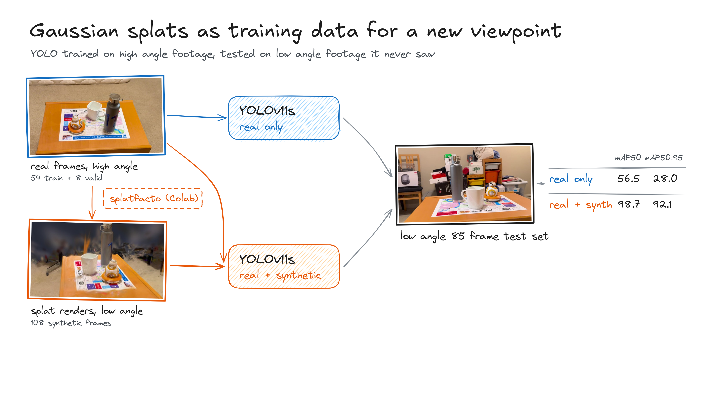

# CIS 5810: Gaussian splats as data augmentation for viewpoint shift



- [Diagram source: Excalidraw](https://excalidraw.com/#room=f3e006a06d871b285ef4,bdkLmREdE2tGR-OZiRx04A)
- [Dataset](https://github.com/trevorkw7/cis-5810-dataset): 62 high-angle frames for training, 85 low-angle frames held blind for testing, 108 splat renders
- [Splat notebook](https://colab.research.google.com/drive/16XE4E3OfA0p5EccHDMrwvLUykVrLxEF1): Nerfstudio splatfacto on Colab, trains the splat from the high-angle frames and renders a low orbit
- [Model v1: real only](https://universe.roboflow.com/new-workspace-9juoy/yolo-real-vs-synthetic-real): Roboflow version 1, YOLOv11s on 54 real frames, 56.5 mAP50 on the blind set
- [Model v3: real + synthetic](https://universe.roboflow.com/new-workspace-9juoy/yolo-real-vs-synthetic-real): Roboflow version 3, same recipe plus the 108 renders, 98.7 mAP50 on the blind set
- [Splat](splat/export/): trained splatfacto model (splat.ply, 194k Gaussians), 31.4 PSNR / 0.922 SSIM / 0.099 LPIPS on 8 held-out high-angle frames
- Weights: [real only](weights/real_only.pt) · [real + synthetic](weights/real_plus_synthetic.pt), fine-tuned YOLOv11s checkpoints exported from Roboflow

| | [Real only (v1)](https://app.roboflow.com/new-workspace-9juoy/yolo-real-vs-synthetic-real/1) | [Real + synthetic (v3)](https://app.roboflow.com/new-workspace-9juoy/yolo-real-vs-synthetic-real/3) |
|---|---|---|
| Train images | 54 real | 54 real + 108 splat renders |
| Labels | SAM 3 | SAM 3 |
| Model | YOLOv11s, COCO-pretrained | YOLOv11s, COCO-pretrained |
| Image size | 640 (stretch) | 640 (stretch) |
| Epochs | 100 | 100 |
| Augmentation | none | none |
| Valid | 8 real high-angle | 8 real high-angle |
| Test | 85 blind low-angle | 85 blind low-angle |
| mAP50 | 56.5 | **98.7** |
| mAP50:95 | 28.0 | **92.1** |
| AP50 mug | 8.6 | 96.6 |
| AP50 bottle | 75.6 | 99.8 |
| AP50 BB-8 | 85.4 | 99.7 |
| Test set | [predictions](https://app.roboflow.com/new-workspace-9juoy/yolo-real-vs-synthetic-real/1/images?split=test&predictions=true) | [predictions](https://app.roboflow.com/new-workspace-9juoy/yolo-real-vs-synthetic-real/3/images?split=test&predictions=true) |

```
splat/
  splatfacto_colab.ipynb      Colab notebook: installs Nerfstudio, trains splatfacto for 15k steps, renders the low orbit, exports the splat
  prepare_input.py            packs the training frames and COLMAP poses into the zip the notebook uploads
  low_orbit_camera_path.json  the 108 low-angle cameras the renders come from
  colmap/                     camera poses and sparse points for the training frames
  export/                     the trained splat (splat.ply), its Nerfstudio config, frame transform and eval metrics
docs/overview.png             pipeline diagram with results
results/RESULTS.md            the same eval table
weights/                      fine-tuned YOLOv11s checkpoints (real only, real + synthetic)
```
